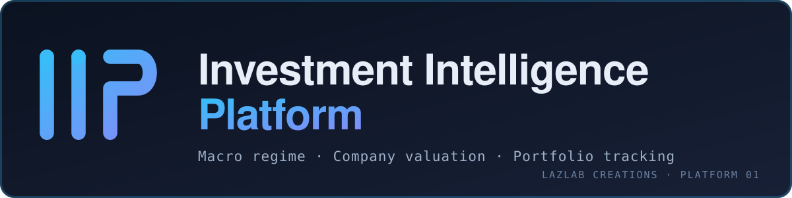
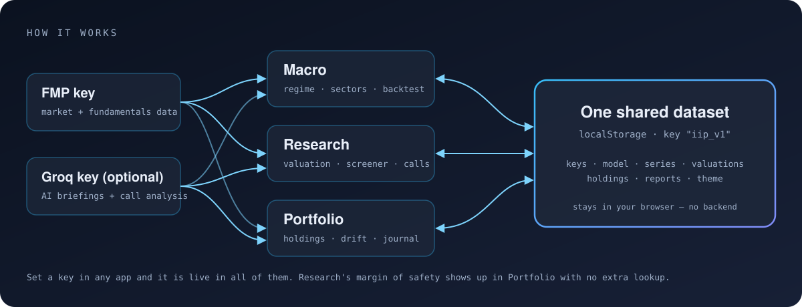

<div align="center">



**Macro regime. Company valuation. Portfolio tracking.**
**One shared dataset. Zero backend. Installs like a native app.**

*A LAZLAB Creations product — Platform 01 · v2.3.0*

</div>

---

## What it is

Most investment tools make you choose: a macro dashboard *or* a valuation model *or* a portfolio tracker — each in its own silo, each with its own login, none talking to each other.

**IIP doesn't make you choose.** A home launcher plus three linked single-file apps share one `localStorage` origin and install once as a Progressive Web App. Set your API key in any of them and it is live in all of them. Look up a stock in Research and Portfolio already knows its margin of safety. No server. No database. No monthly bill.

<div align="center">

</div>

## Live URLs

| | |
|---|---|
| Landing | https://johnlaz.github.io/iip/ |
| App (install this) | https://johnlaz.github.io/iip/app/ |

## What's inside

### 🧭 Macro — *Intelligence*
A six-pillar regime score (growth, labor, inflation, rates, credit, sentiment) built from percentile math you can inspect. Sector rotation with Overweight / Neutral / Underweight calls, an AI-written briefing on what changed, and a **Regime Backtest** that scores every historical month using only data known *at that time* — no lookahead.

### 🔍 Research — *& Valuation*
Three independent valuation methods — DCF, modified Graham, historical multiples — give a range, not a false-precision number. A **Screener** ranks the S&P 500 on trailing fundamentals, **Monitor** tracks earnings and dividend dates, and the **AI Analyst** reads the actual call transcript — labeled as AI synthesis, never folded into the numbers above it.

### 💼 Portfolio — *& Journal*
What you own, how far it has drifted from target, and a plain Overweight / Underweight flag on each position, with margin of safety pulled from Research's cache. A capital-deployment tool that only ever suggests buying underweights, and a **Journal** for the reasoning behind each call.

### 🏠 Home
Live status for all three apps, type-ahead search across the whole platform, a plain-language **Info** guide, saved **Reports** (frozen snapshots), the **build plan**, AI model picker and theming (dark / light, four accents).

## Repo layout

```
/index.html            landing page (browsers); redirects installed launches to /app/
/sw.js                 legacy stub — cleans up pre-2.3 installs, safe to delete later
/README.md
/docs/                 README visuals only (banner.svg, flow.svg)
/app/index.html        Home launcher (install entry point)
/app/iip-macro.html    Macro
/app/iip-research.html Research
/app/iip-portfolio.html Portfolio
/app/manifest.json     PWA manifest (scope /app/)
/app/sw.js             app-shell service worker
/app/icon-192.png      icons (192 + 512, maskable-safe)
/app/icon-512.png
```

Everything under `/app/` must stay in one folder: same origin and path is how the apps share data.

## Get started

1. Open the [app](https://johnlaz.github.io/iip/app/) and install it from the banner (or your browser's install menu).
2. In **Settings** of any app, add a free [FMP API key](https://site.financialmodelingprep.com/register).
3. Optionally add a free [Groq key](https://console.groq.com/keys) for AI features. Every other app already has your keys.

## AI & model setup

AI features use **Groq** only (earnings-call analysis, macro briefings, portfolio and home reads, Ask-AI search).

- The model list is **fetched live** from Groq's `/models` the moment you save a key, and again whenever you press **Refresh live model list** (available in Macro, Research, Portfolio and Home — the choice is shared by all four).
- The default is `openai/gpt-oss-120b`. Refreshing **never swaps your model**: if the one you saved disappears from Groq's list it stays selected and is flagged *(not in current list)* until you choose another.
- Whisper, TTS and guard models are filtered out of the picker.

## Data & privacy

- Everything lives in your browser's `localStorage` (key `iip_v1`). There is no IIP server.
- API keys are sent only to their own provider (FMP, Groq) and are excluded from exported snapshots.
- API responses are never cached by the service worker.
- Use **Export snapshot** in any app to back up or move your data.

## Deploy & update

Static files on GitHub Pages — no build step.

1. Commit the repo to `main`; Pages serves it from the root.
2. When you change any shell file, bump `VERSION` in `app/sw.js` **and** `APP_VERSION` / `BUILD_DATE` in all four app pages (they are checked against each other — a mismatch shows a ⚠ next to the version stamp).
3. Installed users see an **Update ready — tap to reload** pill when the new worker is in.

Moving from a pre-2.3 install: remove the old app and reinstall from `/app/`. Your data is kept (it lives in the origin's `localStorage`, not in the install).

## Changelog

**2.3.0 — 2026-10-07**
- Restructured into landing (root) + app (`/app/`); installs must be redone.
- New service worker (network-first HTML, cache-first assets, offline fallback, update prompt) that only manages IIP's own caches; cache version tied to the in-app version stamp.
- Model refresh no longer replaces a saved model; picker added to Home and Portfolio; list refreshes on key save everywhere.
- Shared-storage saves now merge, so two open IIP tabs no longer overwrite each other.
- New slate / sky / indigo look drawn from the logo; Space Grotesk headings.
- Maskable-safe 192 / 512 icons only; manifest `id` added.
- Accessibility: labelled icon buttons, live toast, combobox search, dialog roles.

## Honest limitations

- **Valuation is still being tested against real companies** — the math is verified against synthetic data, but sanity-checking on diverse real businesses is ongoing.
- **Screener and Monitor use trailing ratios**, not the full DCF / Graham / multiples engine — Research's single-ticker view is where the real math lives.
- **The Backtest applies today's weights retroactively**; it deliberately does not auto-optimize weights against history.
- **No CAPE, forward P/E or market cap / GDP** — no clean data source, so they are absent rather than faked.

---

<div align="center">

**Built by [John Lazzaro](https://johnlaz.github.io) · LAZLAB Creations**
© 2026 LAZLAB Creations. All Rights Reserved. · lazlab.io@gmail.com

*Not investment advice. Not a licensed financial product. A tool for your own research.*

</div>
